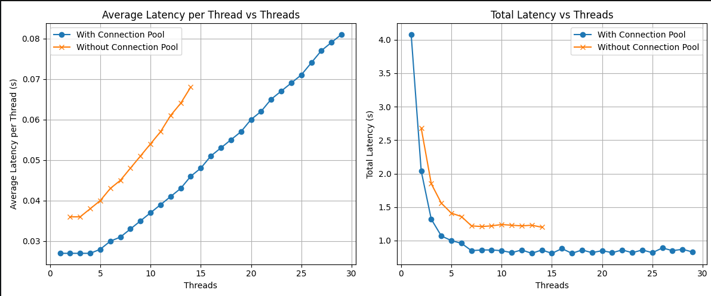
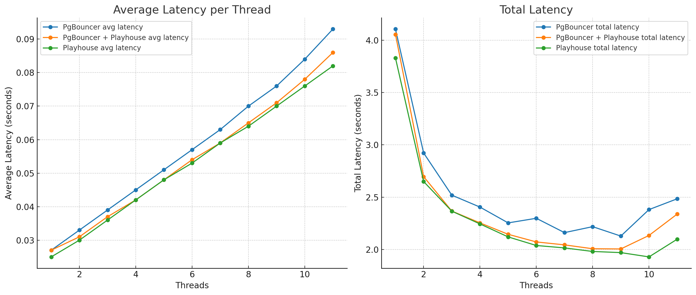

# DB Load Benchmark

- Test performed on db table accounts with 100,000 fake records inserted
- Hardware: 8 vCPU, 24GB memory

## Materials:

- Python test script: `../scripts/db_load.py` with these filters

```py
filtered_accounts = Account.select().where(
            (Account.is_active == 1) & (Account.updated_at > threshold_date)
        )
```

- Models and ORM logic: `models/Account.py & models/Base.py` (peewee) - 150 queries being made to the databse using thread pool executors with different concurrencies
- Connection pool using playhouse(except for one case):
- htop for monitoring 
```py
database = PooledPostgresqlDatabase(
    database_name,
    user=user,
    host=host,
    port=port,
    max_connections=50,
    stale_timeout=100,
)
```

## Results:

### Concurrency: 1 - 30

```
$ python -m scripts.db_load
average latency per thread 0.027 - Threads: 1 - Total Latency: 4.0800018310546875
average latency per thread 0.027 - Threads: 2 - Total Latency: 2.0375723838806152
average latency per thread 0.027 - Threads: 3 - Total Latency: 1.3220067024230957
average latency per thread 0.027 - Threads: 4 - Total Latency: 1.0678684711456299
average latency per thread 0.028 - Threads: 5 - Total Latency: 0.9968891143798828
average latency per thread 0.03 - Threads: 6 - Total Latency: 0.9615833759307861
**average latency per thread 0.031 - Threads: 7 - Total Latency: 0.8514382839202881**
average latency per thread 0.033 - Threads: 8 - Total Latency: 0.8551077842712402
average latency per thread 0.035 - Threads: 9 - Total Latency: 0.8569934368133545
average latency per thread 0.037 - Threads: 10 - Total Latency: 0.8547055721282959
average latency per thread 0.039 - Threads: 11 - Total Latency: 0.8176274299621582
average latency per thread 0.041 - Threads: 12 - Total Latency: 0.8610396385192871
average latency per thread 0.043 - Threads: 13 - Total Latency: 0.8120989799499512
average latency per thread 0.046 - Threads: 14 - Total Latency: 0.8633601665496826
average latency per thread 0.048 - Threads: 15 - Total Latency: 0.8125936985015869
average latency per thread 0.051 - Threads: 16 - Total Latency: 0.8790090084075928
average latency per thread 0.053 - Threads: 17 - Total Latency: 0.8090353012084961
average latency per thread 0.055 - Threads: 18 - Total Latency: 0.8552169799804688
average latency per thread 0.057 - Threads: 19 - Total Latency: 0.8155596256256104
average latency per thread 0.06 - Threads: 20 - Total Latency: 0.8533041477203369
average latency per thread 0.062 - Threads: 21 - Total Latency: 0.8227880001068115
average latency per thread 0.065 - Threads: 22 - Total Latency: 0.8566343784332275
average latency per thread 0.067 - Threads: 23 - Total Latency: 0.822098970413208
average latency per thread 0.069 - Threads: 24 - Total Latency: 0.8615264892578125
average latency per thread 0.071 - Threads: 25 - Total Latency: 0.8157200813293457
average latency per thread 0.074 - Threads: 26 - Total Latency: 0.8942418098449707
average latency per thread 0.077 - Threads: 27 - Total Latency: 0.854780912399292
average latency per thread 0.079 - Threads: 28 - Total Latency: 0.8719744682312012
average latency per thread 0.081 - Threads: 29 - Total Latency: 0.8270812034606934

```

### Concurrency: 2 - 14 & Without connection pool

```
$ python -m scripts.db_load
average latency per thread 0.036 - Threads: 2 - Total Latency: 2.682548999786377
average latency per thread 0.036 - Threads: 3 - Total Latency: 1.8484277725219727
average latency per thread 0.038 - Threads: 4 - Total Latency: 1.5605175495147705
average latency per thread 0.04 - Threads: 5 - Total Latency: 1.407853126525879
average latency per thread 0.043 - Threads: 6 - Total Latency: 1.362640380859375
average latency per thread 0.045 - Threads: 7 - Total Latency: 1.2228670120239258
average latency per thread 0.048 - Threads: 8 - Total Latency: 1.206465244293213
average latency per thread 0.051 - Threads: 9 - Total Latency: 1.2189910411834717
average latency per thread 0.054 - Threads: 10 - Total Latency: 1.2417504787445068
average latency per thread 0.057 - Threads: 11 - Total Latency: 1.2278814315795898
average latency per thread 0.061 - Threads: 12 - Total Latency: 1.2213966846466064
average latency per thread 0.064 - Threads: 13 - Total Latency: 1.234936237335205
average latency per thread 0.068 - Threads: 14 - Total Latency: 1.1965422630310059
```

## Conclusion

- The optimum state of concurrency is using `7 to 11 threads`; Using more threads than this only increases latency without increasing the throughput. At this level of concurrency the CPU usage was about 100%.

| Number | CPU Usage |
|--------|-----------|
| 3      | 60%       |
| 4      | 70%       |
| 5      | 80%       |
| 6      | 90%       |
| 7      | 100%      |

- Using **connection pool** has a significant impact on both throughput and latency.
- CPU‌ usage 

## PGBouncer vs Playhouse
Playhouse was slightly better than PGBouncer(with the same logic told in the top of the doc only with `200,000 records`) and both were significantly efficient than non-pooled connection

### PGBouncer 
```
╰─>$ python -m scripts.db_load
average latency per thread 0.027 - Threads: 1 - Total Latency: 4.106290102005005
average latency per thread 0.033 - Threads: 2 - Total Latency: 2.922060489654541
average latency per thread 0.039 - Threads: 3 - Total Latency: 2.519289016723633
average latency per thread 0.045 - Threads: 4 - Total Latency: 2.4054853916168213
average latency per thread 0.051 - Threads: 5 - Total Latency: 2.2544989585876465
average latency per thread 0.057 - Threads: 6 - Total Latency: 2.298245906829834
average latency per thread 0.063 - Threads: 7 - Total Latency: 2.1614620685577393
average latency per thread 0.07 - Threads: 8 - Total Latency: 2.218318223953247
average latency per thread 0.076 - Threads: 9 - Total Latency: 2.128183126449585
average latency per thread 0.084 - Threads: 10 - Total Latency: 2.3813114166259766
average latency per thread 0.093 - Threads: 11 - Total Latency: 2.48358416557312

```
### PGBouncer + Playhouse
```
─>$ python -m scripts.db_load
average latency per thread 0.027 - Threads: 1 - Total Latency: 4.055471897125244
average latency per thread 0.031 - Threads: 2 - Total Latency: 2.6963963508605957
average latency per thread 0.037 - Threads: 3 - Total Latency: 2.3665339946746826
average latency per thread 0.042 - Threads: 4 - Total Latency: 2.253509044647217
average latency per thread 0.048 - Threads: 5 - Total Latency: 2.1446127891540527
average latency per thread 0.054 - Threads: 6 - Total Latency: 2.071953296661377
average latency per thread 0.059 - Threads: 7 - Total Latency: 2.0436041355133057
average latency per thread 0.065 - Threads: 8 - Total Latency: 2.0070104598999023
average latency per thread 0.071 - Threads: 9 - Total Latency: 2.005492925643921
average latency per thread 0.078 - Threads: 10 - Total Latency: 2.134134531021118
average latency per thread 0.086 - Threads: 11 - Total Latency: 2.3380796909332275
```

### Playhouse
```
╰─>$ python -m scripts.db_load
average latency per thread 0.025 - Threads: 1 - Total Latency: 3.830418109893799
average latency per thread 0.03 - Threads: 2 - Total Latency: 2.6493985652923584
average latency per thread 0.036 - Threads: 3 - Total Latency: 2.3663153648376465
average latency per thread 0.042 - Threads: 4 - Total Latency: 2.243662118911743
average latency per thread 0.048 - Threads: 5 - Total Latency: 2.1200380325317383
average latency per thread 0.053 - Threads: 6 - Total Latency: 2.0384085178375244
average latency per thread 0.059 - Threads: 7 - Total Latency: 2.014775514602661
average latency per thread 0.064 - Threads: 8 - Total Latency: 1.981492280960083
average latency per thread 0.07 - Threads: 9 - Total Latency: 1.9696934223175049
average latency per thread 0.076 - Threads: 10 - Total Latency: 1.9294767379760742
average latency per thread 0.082 - Threads: 11 - Total Latency: 2.09770512580871
```

###